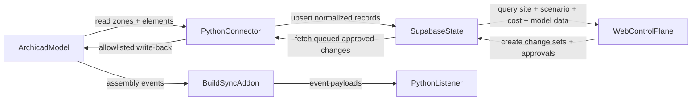

# Architecture Overview

## Summary

The MVP is a construction feasibility and model-control loop around Archicad. It connects site selection, scenario options, cost assumptions, schedule views, operational package state, and governed metadata write-back.

- Archicad remains the geometry authority.
- Supabase acts as the operational system of record.
- The web app manages reviewable operational edits.
- The connector is the only write-back path into Archicad.
- BuildSync/native-side event capture is a companion track and must use explicit listener contracts.

## Primary Components

### Archicad

Owns:

- geometry
- model object identities
- CCP property storage for approved values
- schedules and Graphic Overrides that react to CCP properties

### Supabase

Owns:

- projects
- development sites and scenario options
- feasibility, cost, schedule, and project-network records
- normalized model-linked records
- scenarios
- operational state
- change sets and approvals
- sync run logs and audit events

### Web App

Owns:

- site, scenario, feasibility, cost, schedule, and model-linked inspection
- operational editing through governed workflows
- draft change-set creation
- approval workflow views
- read-only linear scheduling visualization
- project-network inquiries, knowledge packs, profiles, and work products
- desktop companion controls for inbound/outbound/snapshot filtering

The UI must never write directly to Archicad.

### Python Connector

Owns:

- reading `zones` and selected elements from Archicad
- mapping Archicad payloads into normalized records
- pushing inbound records into Supabase
- fetching approved queued changes
- validating outbound values against the allowlist
- writing approved CCP properties back to Archicad

### BuildSync Native Add-on And Listener

Own:

- native-side assembly event capture
- local event persistence and command polling
- adapter-level interaction with Archicad SDK functionality as it lands

The BuildSync path is currently less mature than the Python connector path. Its C++ JSON payloads and Python listener models should be contract-tested before it becomes part of the primary product spine.

## Linear Scheduling Note

The first linear scheduling milestone is read-only and external to Archicad.

It uses:

- project and scenario metadata
- explicit location-axis definitions
- plotted activity records for linear, bar, block, and milestone views
- explicit schedule-view metadata for stage-flow nodes and edges
- activity metadata that can map plotted items back to high-level stages

The current web implementation also includes a companion Gantt, stage-flow highlighting, and multi-package filtering, but it does not yet introduce editing behavior or geometry-derived stationing.

## First Vertical Slice

The original first slice intentionally stayed narrow:

1. read `zones` plus a small element subset from Archicad
2. upsert them into Supabase-aligned storage
3. display them in the web app
4. create and approve package assignment change sets
5. write back `CCP_PackageID`
6. confirm the result in Archicad schedules or Graphic Overrides

The app has since widened. The current focus is the feasibility-to-control workflow:

1. choose a development site
2. compare scenario options, yield, cost bands, planning fit, and margin
3. connect a viable option to base-cost templates and read-only schedule views
4. inspect linked zones/model objects and package state
5. create, approve, queue, and sync allowlisted operational changes
6. record audit events and Archicad write evidence

## Data Flow

## Local Development Note

The codebase includes a local file-backed demo path for development and validation where live Supabase or Archicad access is not available. That path exists to exercise the workflow without changing the architecture boundaries.

That demo path currently uses a townhouse-oriented seed dataset and a mutable runtime snapshot under `shared/examples/runtime/`. The web app refreshes that runtime snapshot automatically when the seed file is newer so demo data changes show up without manual file copying.

The web app can also run against Supabase with `CCP_DATA_SOURCE=supabase`; the layout surfaces the active mode so reviewers know whether they are looking at demo JSON or live-backed state.

## Security References

Security expectations for this architecture are documented in:

- `docs/decisions/ADR-006-security-and-trust-boundaries.md`
- `docs/threat_model.md`
