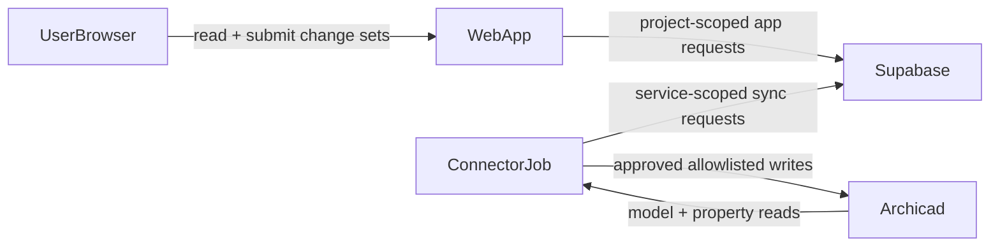

# Threat Model

## Purpose

This document provides a lightweight threat model for the Archicad Construction Control Plane MVP so security can be implemented incrementally as the system evolves.

It complements:

- `docs/architecture_overview.md`
- `docs/decisions/ADR-001-system-boundaries.md`
- `docs/decisions/ADR-006-security-and-trust-boundaries.md`
- the security-by-stage sections in `specs/`

## Trust Boundaries

Primary boundaries:

- browser vs backend/connector privileges
- project-scoped application access vs elevated service operations
- operational metadata vs geometry-authoring authority
- demo/local runtime state vs future live service integrations

## Sensitive Assets

- service-role credentials and API keys
- project-scoped operational data
- approval decisions and audit history
- Archicad write permissions
- change-set integrity and status transitions

## Main Threats

### 1. Elevated credential exposure

Risk:
- service-role credentials leak to the browser, logs, or committed files

Mitigations:
- keep service-role usage in backend or connector execution contexts only
- load secrets from environment or managed secret sources
- avoid logging raw headers, tokens, or secret values

### 2. Unauthorized project access

Risk:
- a user or workflow reads or mutates data outside its assigned project scope

Mitigations:
- enforce project-scoped RLS and access checks
- carry project membership in session or JWT context
- validate scope on all mutating actions

### 3. Approval bypass

Risk:
- outbound Archicad writes occur without a valid approved and queued change set

Mitigations:
- model edits as change sets only
- enforce state-machine validation before queue and sync
- record approval and sync events in audit history

### 4. Unsafe Archicad write expansion

Risk:
- connector writes fields outside the approved operational allowlist

Mitigations:
- maintain a strict writable-field allowlist
- fail closed on unknown fields
- expand write scope only with matching validator and test updates

### 5. Identity mismatch or stale-target writes

Risk:
- writes land on the wrong object because of stale or ambiguous identity mapping

Mitigations:
- use stable Archicad GUID identity for model-linked records
- validate target existence and writeability before outbound sync
- block sync when identity context is stale or ambiguous

### 6. Sensitive data leakage into business data stores

Risk:
- secrets or privileged backend-only identifiers are written into Supabase business tables, audit payloads, or Archicad properties

Mitigations:
- keep Archicad properties operational-only
- keep audit payloads reconstruction-friendly but secret-free
- review snapshot and log payloads for unnecessary sensitive content

### 7. Demo-mode drift from live security model

Risk:
- local/demo implementations bypass the trust model so thoroughly that later live integrations are unsafe by design

Mitigations:
- preserve the same logical boundaries in demo mode
- keep adapters separate from the core workflow logic
- treat demo mode as a simulation of live security constraints, not a replacement for them

## Security Requirements By Stage

### Repo and contracts

- document trust boundaries, roles, and secret ownership
- keep shared enums and state transitions explicit

### Database

- add RLS and project-scoped access assumptions with the schema
- define which operations require elevated backend-only execution

### Web app

- do not expose elevated credentials
- validate allowed state transitions and role-sensitive actions

### Connector

- keep outbound writes allowlisted and approval-gated
- support dry-run validation and safe failure modes
- avoid secret leakage in logs and runtime state

### Later live integrations

- add credential rotation guidance
- add auth failure and unauthorized access tests
- review RPC/helpers for privilege escalation risk

## Current Residual Risks

- demo mode does not yet exercise real authentication flows
- runtime-file handling is less secure than a live backend environment
- service-role and production secret handling are specified but not yet implemented end to end
- threat coverage for CI/CD and deployment infrastructure is still out of scope for the current MVP repo

## Review Trigger Points

Revisit this threat model whenever:

- a new write path is introduced
- a new credential type or external integration is added
- outbound field scope expands
- approval or role semantics change
- deployment moves from demo/local mode toward shared or production environments
