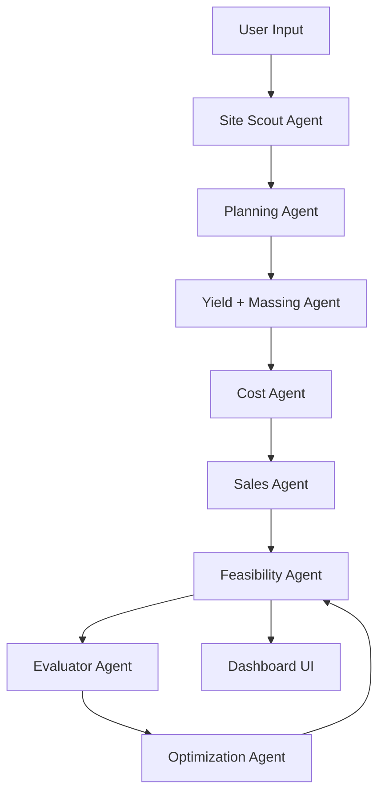

# Townhouse Feasibility Agentic System

## [spec.md](http://spec.md)

---

# 1. Vision

Build an agentic townhouse feasibility platform capable of:

- discovering residential development sites
- evaluating planning feasibility
- generating conceptual yield schemes
- estimating costs and revenue
- calculating development margin
- identifying sensitivity and risk
- iteratively improving feasibility through optimization agents

The system should behave like a disciplined development analyst team rather than a static spreadsheet.

Primary target:

- Melbourne / Victoria townhouse development feasibility
- Small-medium infill development
- 2–6 townhouse projects
- Premium downsizer and middle-market product

---

# 2. Core Principle

The system MUST NOT merely calculate user-entered assumptions.

The system MUST:

1. generate assumptions
2. challenge assumptions
3. test multiple scenarios
4. identify weak assumptions
5. suggest margin improvement strategies
6. explain WHY a project works or fails

---

# 3. High-Level Architecture




---

# 4. System Goals

## Primary Goals

- Rapid feasibility analysis
- Transparent assumptions
- Margin targeting
- Risk identification
- Scenario comparison
- Semi-autonomous site evaluation

## Non-Goals (Phase 1)

- Certified town planning advice
- Full architectural documentation
- Automated permit approval
- Construction drawings
- Fully autonomous purchasing decisions

---

# 5. Target User Workflow

## Example User Request

```text
Find townhouse sites in Hampton East capable of achieving 30% margin.

```

System response flow:

1. Discover candidate sites
2. Evaluate planning controls
3. Predict likely dwelling yield
4. Generate conceptual scheme
5. Estimate construction cost
6. Estimate resale value
7. Calculate profitability
8. Identify risk
9. Suggest optimization levers
10. Rank candidate sites

---

# 6. Agent Definitions

---

## 6.1 Site Scout Agent

### Purpose

Find candidate development sites.

### Inputs

- suburb
- budget
- target margin
- min/max land size
- zoning preferences

### Responsibilities

- search listing APIs/web sources
- extract:
  - address
  - land size
  - frontage
  - slope estimate
  - overlays
  - asking price
  - nearby sale evidence

### Outputs

```json
{
  "address": "",
  "land_size_sqm": 0,
  "asking_price": 0,
  "zone": "",
  "overlays": [],
  "frontage_m": 0
}

```

### Constraints

- Must preserve source URLs
- Must track confidence
- Must flag incomplete data

---

## 6.2 Planning Agent

### Purpose

Estimate likely planning yield.

### Responsibilities

- evaluate zoning
- evaluate overlays
- estimate:
  - likely dwelling count
  - setbacks
  - height limits
  - permeability
  - open space
  - parking impacts

### Outputs

```json
{
  "likely_yield": 4,
  "confidence": 0.72,
  "planning_risks": [],
  "key_constraints": []
}

```

### Important

This is heuristic only.  
Must never claim certainty.

---

## 6.3 Yield + Massing Agent

### Purpose

Generate conceptual development configuration.

### Responsibilities

- estimate dwelling footprints
- estimate circulation efficiency
- estimate site coverage
- estimate private open space
- estimate GFA

### Outputs

```json
{
  "townhouses": [
    {
      "gfa_sqm": 190,
      "bedrooms": 3,
      "car_spaces": 2
    }
  ],
  "total_gfa": 760
}

```

### Future Integration

Phase 2:

- Archicad API
- IFC viewer
- procedural massing engine

---

## 6.4 Cost Agent

### Purpose

Estimate development costs.

### Responsibilities

Estimate:

- construction cost
- demolition
- authority costs
- consultants
- finance
- contingency
- marketing
- landscaping
- infrastructure

### Output

```json
{
  "construction_cost": 3200000,
  "consultants": 250000,
  "finance": 330000,
  "total_cost": 5900000
}

```

### Important

Costs MUST:

- contain date stamps
- contain source references
- support escalation factors

---

## 6.5 Sales Agent

### Purpose

Estimate project GDV.

### Responsibilities

- search comparable sales
- estimate resale values
- apply confidence ranges

### Output

```json
{
  "estimated_gdv": 8200000,
  "low_case": 7700000,
  "high_case": 8600000
}

```

### Important

Must preserve:

- comparable sale evidence
- distance from subject site
- sale dates

---

## 6.6 Feasibility Agent

### Purpose

Calculate project viability.

### Responsibilities

Calculate:

- margin on cost
- developer profit
- residual land value
- equity multiple
- debt exposure
- sensitivity analysis

### Output

```json
{
  "margin_on_cost": 0.31,
  "profit": 1800000,
  "passes_target": true
}

```

---

## 6.7 Evaluator Agent

### Purpose

Challenge the scheme.

### CRITICAL

This is one of the most important agents.

The Evaluator Agent MUST:

- attack optimistic assumptions
- identify weak assumptions
- identify fragile margin
- identify planning risks
- identify construction complexity risks

### Example Challenges

```text
Sale prices exceed local market evidence.
Yield likely optimistic due to corner splay setback.
Build cost too low for premium finish.
Basement risk not priced adequately.

```

### Output

```json
{
  "risk_score": 0.61,
  "critical_risks": [],
  "fragile_assumptions": []
}

```

---

## 6.8 Optimization Agent

### Purpose

Improve feasibility.

### Responsibilities

Search for:

- reduced build cost
- improved layout efficiency
- improved yield
- alternative product mix
- reduced basement complexity
- improved staging strategy

### Example

```text
Reduce average dwelling size from 205sqm to 188sqm.
Eliminate complex roof geometry.
Convert basement to surface parking.

```

---

# 7. State Management

System MUST support:

- restartable execution
- deterministic replay
- persistent handoff state

## Required Files

```text
/spec.md
/state/session.json
/handoffs/
    planner.md
    evaluator.md
/evals/

```

---

# 8. Data Model

---

## Site Object

```json
{
  "site_id": "",
  "address": "",
  "coordinates": {},
  "land_size_sqm": 0,
  "zone": "",
  "overlays": []
}

```

---

## Scheme Object

```json
{
  "scheme_id": "",
  "townhouse_count": 4,
  "total_gfa": 780,
  "parking_count": 8
}

```

---

## Feasibility Object

```json
{
  "total_cost": 0,
  "gdv": 0,
  "profit": 0,
  "margin": 0
}

```

---

# 9. Margin Rules

## Important

The app MUST separate:

- required residual debt
- optional refinance capacity
- gross profit
- cash profit
- retained equity

These MUST NOT be conflated.

---

# 10. Risk System

Each assumption MUST contain:

```json
{
  "value": 4200,
  "unit": "$/sqm",
  "confidence": 0.71,
  "source": "",
  "date": ""
}

```

---

# 11. UI Goals

Design language:

- dark mode
- enterprise minimal
- Linear/Figma/Notion level restraint
- dense but readable

Avoid:

- glowing UI
- excessive gradients
- dribbble aesthetics

---

# 12. Dashboard Requirements

## Required Panels

### Site Summary

- address
- zoning
- overlays
- land size

### Feasibility

- total cost
- GDV
- profit
- margin

### Risks

- planning risk
- sales risk
- build risk

### Margin Levers

- cost reductions
- revenue increases
- yield changes

---

# 13. Recommended Tech Stack

## Frontend

- React
- Tailwind
- Zustand
- TanStack Query

## Backend

- Python FastAPI
- PostgreSQL
- Supabase

## AI Orchestration

- LangGraph OR custom orchestrator
- structured JSON outputs
- agent state persistence

---

# 14. Future Roadmap

## Phase 2

- procedural massing engine
- Archicad integration
- IFC viewer
- automated yield diagrams
- planning rule extraction

## Phase 3

- autonomous site scouting
- nightly market monitoring
- development strategy recommendations
- lender/debt optimization

---

# 15. Critical Design Philosophy

This system is NOT:

- a chatbot
- a spreadsheet wrapper

This system IS:

- a development reasoning engine
- an assumption testing engine
- a margin optimization engine
- a structured agentic workflow system

The most important feature is not prediction.

The most important feature is:

- identifying weak assumptions
- revealing hidden risk
- exposing fragile feasibility
- improving decision quality

---

